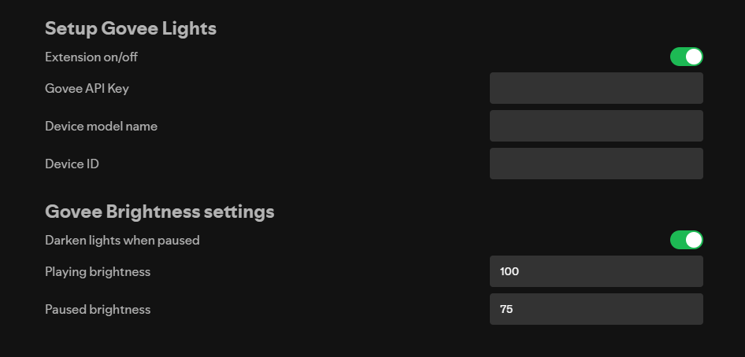

# Govee Dynamic Lights

A [Spicetify](https://spicetify.app/) extension that dynamically sets your Govee RGB lights to match the current album cover color using the WIFI API.

## Showcase




## Prerequisites
- [Spicetify](https://spicetify.app/) installed on your Spotify client.
- Govee WIFI-capable RGB lights that [can connect to Govee's API](https://developer.govee.com/docs/support-product-model).
- A [Govee API Key](https://developer.govee.com/reference/apply-you-govee-api-key).
- Your device model name and device ID.
    1. Using [this website](https://govee.readme.io/reference/getlightdeviceinfo), enter your Govee API key on the right side under "Credentials" where it says "Header".
    2. Click "Try It!"
    3. Under "Response", look for these two values
    ```json
    "device": "[your device id here]",
    "model": "[your device model here]",
    ```
    4. "device" is your device id. "model" is your model name. Keep these somewhere as you'll need these later.
    > [!WARNING]
    > Copying the quotes will result in the extension not being able to reach your device. Make sure to not copy the quotes. For example, your device ID should be XX:XX:XX:XX:XX:XX:XX:XX, not "XX:XX:XX:XX:XX:XX:XX:XX".

## Setup Instructions

1. Install the extension using the Spicetify Marketplace
2. Configure the extension:
   - Go to settings by clicking on your profile picture in the top right corner and clicking "Settings"
   - Scroll down until you see "Setup Govee Lights"
   - Fill in the required information:
     - **Govee API Key**: Your Govee API Key. It should look something like XXXXXXXX-XXXX-XXXX-XXXX-XXXXXXXXXXXX.
     - **Device model name**: The device model name you got from the website. It should look something like HXXXX.
     - **Device ID**: The device ID you got from the website. It should look something like XX:XX:XX:XX:XX:XX:XX:XX.
    > [!WARNING]
    > Not getting these values exactly right will result in the extension not being able to reach your device.

## Thanks to

- [Dynamic Lights Home Assistant](https://github.com/muckelba/dynamic-lights-homeassistant/) for inspiration